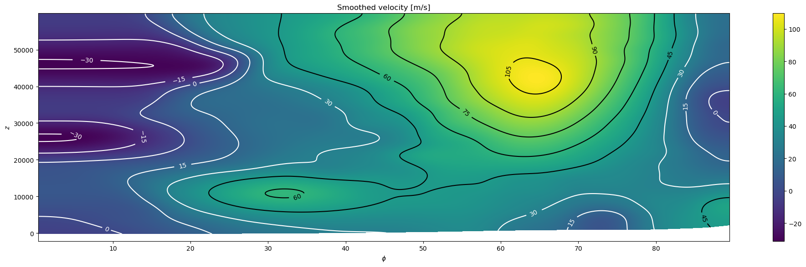

# Background states of the atmosphere



This repository contains a python package to solve a 2d semi-discrete optimal transport problem arising in the calculation of background states of the atmosphere. 

## Installation

Clone the repository, change into the directory and install with pip

```
git clone --recurse-submodules https://gitlab.gwdg.de/egan2/background-states-of-the-atmosphere.git
cd background-states-of-the-atmosphere
pip install .
```

For an editable install (python files are linked instead of copied), use `pip install -e .` instead.

Dependencies: `pip`, `g++` (with support for C++20), `ninja`, `cmake` (possibly more, to be filled in)

To update an existing installation, go to the directory `background-states-of-the-atmosphere` and run

```
git pull
pip install .
```

If you installed originally in a virtual environment, make sure to have the same configuration when updating.
If you modified any files in the repository (e.g. by executing the notebook), the command `git pull` may fail. To resolve this, you can use `git stash` to stash your changes or simply rename the modified file before pulling.

## Usage

We will add proper documentation later, for now there is a jupyter notebook [example](examples/example.ipynb).

Incomplete, auto-generated documentation of the C++ and Python code can be found [here](https://charlieegan.github.io/background-states-of-the-atmosphere/). Python bindings of C++ objects are currently not part of the documentation but generally the same names are used (though they may be read-only from python).

## License
MIT


